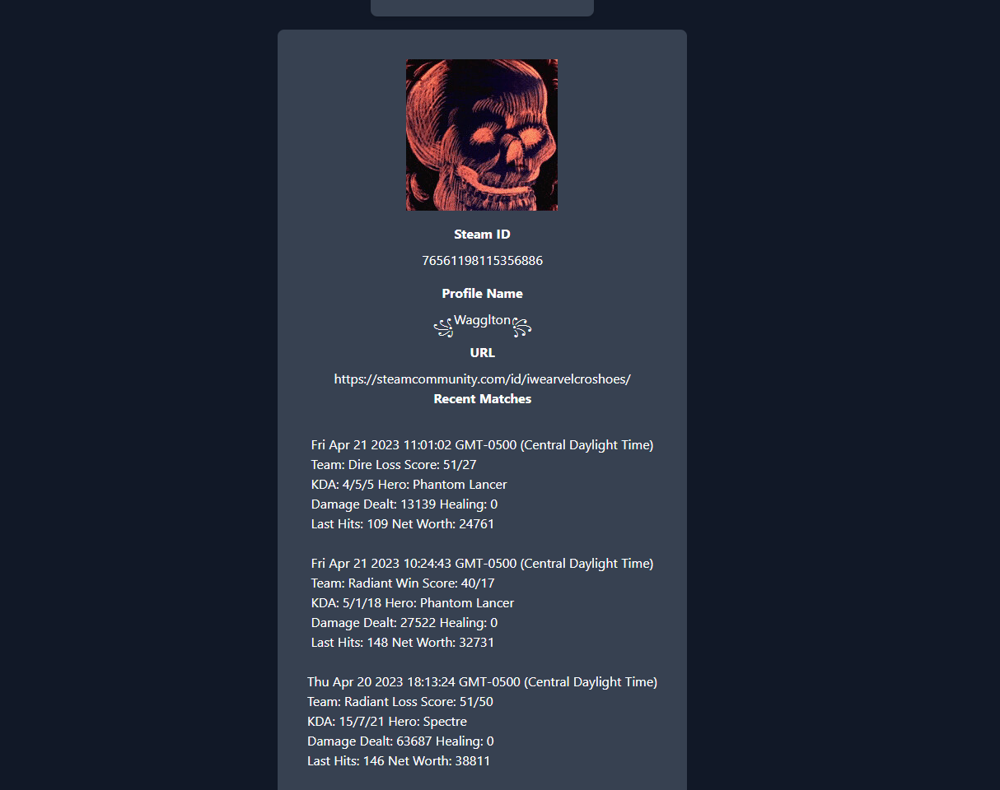

# DotA-Match-Finder

# Description 

Users will have to enter in a SteamID to generate response.

Provides steam information, such as SteamID, Profile Name, and URL to steam account
Provides information on Dota2 player's latest 5 matches.
- Displays played time
- Win or Lose
- KDA ( Kill Death Assist ) 
- Hero USed
- Damaged Dealt

# Usage 
Using a SteamID to find another players Steam information and their Dota2 Matches. 

# Live page
https://bergeb.github.io/DotA-Match-Finder/

# Screenshot

 

# Credits
Erik Berg
Peng Vang
Erik Anderson
Nelson Lynch

